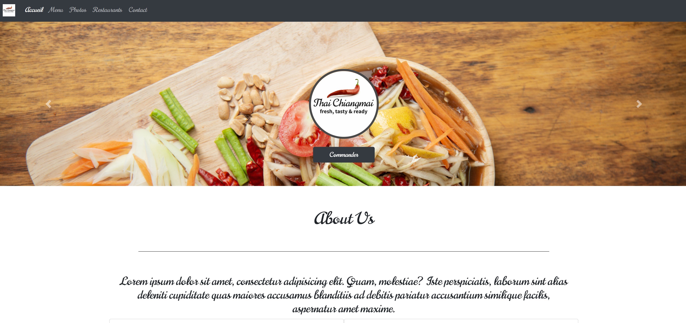

# 6-bootstrap-css-framework
## Thai Chiangmai Café

Creation d'un site web pour un restaurant. utilisation de boostrap et flexbox.

**A quoi ça ressemble ?** 

 

## Conditions de l'exercice

5 Pages : Accueil - Menu - Gallerie - Restaurants - Contact
* **Accueil** :Carousel et panels.
* **Menu**: List group avec collapse.
* **Gallerie**: Lightbox Bootstrap/JS.
* **Restaurants**: Maps iframe.
* **Contact**: Contact form.

## Construit avec

* Html5/Css3
* Bootstrap
* Flexbox

## Autheur

* **Nicolas Tassin** - *Travail initial* - https://github.com/NicolasTassin

    * **Lien LinkedIn** : https://www.linkedin.com/in/nicolas-tassin/
    

